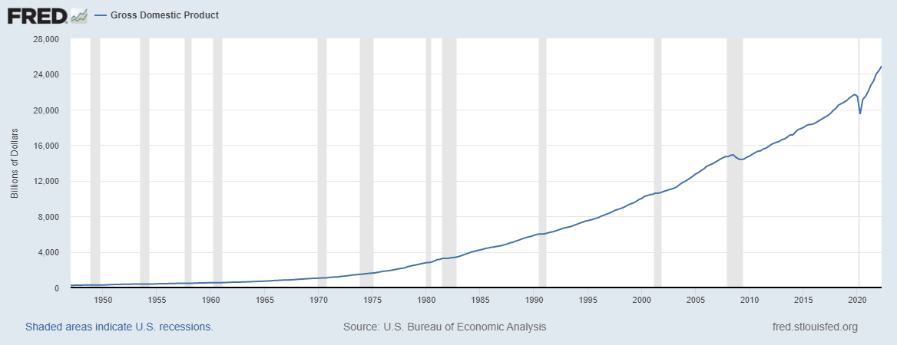
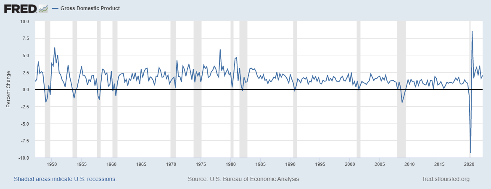
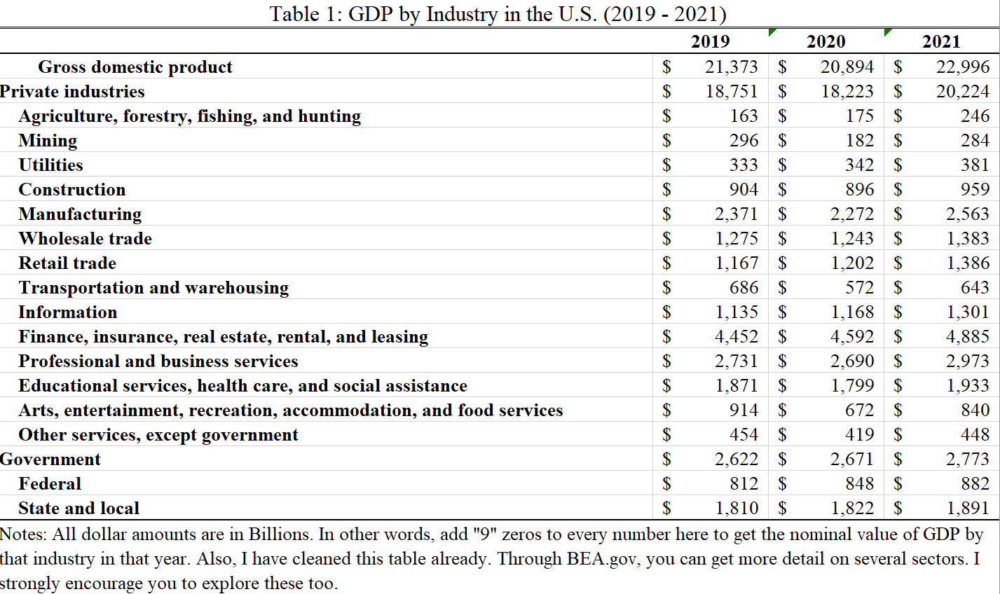
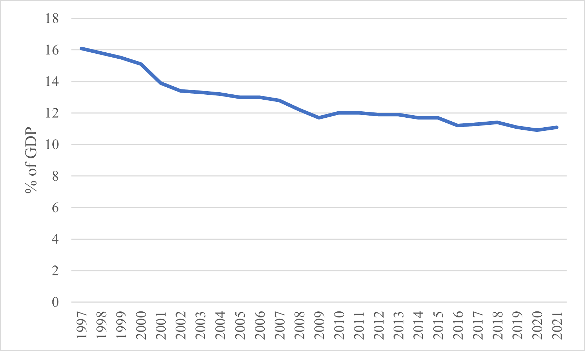
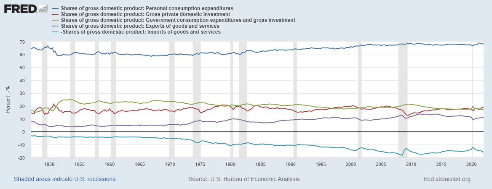

# Measuring the Economy: Means as Ends or Means to Ends?

## Purpose & Learning Objectives

The purpose of this chapter is to ground our collective ability to describe the economy through a number of important **measures**, or standards of judgement, that we seem to think are useful indicators that the economy is doing what we want it to do. After reading this chapter, students will be able to:

  1. Define Gross Domestic Product (GDP).
  2. Articulate the formula for GDP and the relative contributions of each component of GDP to its total value. 
  3. Critique GDP as a measure and define the Human Development Index (HDI).
  3. Describe the difference between a data series that is a "level" vs a "rate".
  
## Just how big is it?

The first task in any serious examination of a subject is to define the unit of analysis. Here in Macroeconomics, we are analyzing the economy as a whole - what it does, how it works, and how healthy it is. Our starting point for this introduction is **Gross Domestic Product (GDP)**. GDP is the main measure of economic activity in the world. We use it to answer a set of specific questions: 

  1.    How big is the economy?
  2.    Is the economy growing, shrinking, or stable?
  3.    What sectors are the most important to the economy?
  
### Defining GDP

First, let's define this measure and then we will set out to answer these three questions. **GDP is the total market value of all final goods and services produced domestically in a given year**. You'll want to commit that definition to memory. We will come back to it often and you will be tested on it, often. 

This definition rests on three important terms: *market value*, *final goods and services*, and *domestically.* "Market value", in economics, is simply the price buyers actually pay for a good or service times the quantity they buy. If you bought 5 cups of coffee this morning at $3.00 a cup, the "market value" of that purchase was \$15.00. If a buyer purchased a 100 bushels of wheat to produce some flour at \$9.91 a bushel, the market value of that purchase was \$991.00. Both of these transactions have a value in the market...BUT, only one of those counts toward GDP - the coffee of course!. Here's why.

GDP relies on the notion of a *final good or service*. These are goods and services that are purchased to be consumed/used, not to become part of another production process. This latter type of good is called an *intermediate good* - it is purchased to incorporate into the production process of a final good. For example, rubber is purchased to produce tires. Tires are produced for a new car/truck. The final good here is the car/truck, not the rubber.^[The tires are tricky one. If they are sold with the car, they are not a final good/service. But, if they are sold to a customer to replace an existing tire, they are a final good/service.] 

Finally, GDP is constructed on the idea of *domestic* production. It is a measure of the economic activity happening within a country's political borders. Businesses from countries from all of the world produce in the United States. All of the final goods produced and sold by those plants and factories operating here in the US count toward the United States' GDP. The size of their contribution is the *market value* of their final sales.

### Measuring GDP

Now that we have some initial clarity on the definition of GDP, let's see it in action. The agency responsible for measuring and reporting out U.S. GDP is called the [Bureau of Economic Analysis](www.bea.gov). Go there now and try to find the data for GDP.^[Look under the heading "Data by Topic" and then "Interactive Data". If you can't find it initially, then you may follow this [link](https://apps.bea.gov/iTable/iTable.cfm?reqid=19&step=2#reqid=19&step=2&isuri=1&1921=survey).] In general, just look around for a minute and see just a snapshot of what's there.

We will use [Bureau of Economic Analysis](www.bea.gov) a fair bit in the coming weeks. For now, let's keep practicing with the [St. Louis FRED](https://fred.stlouisfed.org/) website. Using the search tool, go find the data series for "Gross Domestic Product". When you do, you should be able to reproduce Figure 1 below.


```{r, echo = F, out.width= '75%', fig.align='center', fig.cap= "US GDP (1947-2021"}

    
```


Let's explore Figure 1 for a moment. Before you look to closely at the line graph, I want you to look at the X and Y axes. Go slowly here, there's no rush. Make sure you know what the axes are AND what **units** they are in. The X-axis is pretty clear: it's just the year with labels only showing up in 5-year intervals. The Y-axis though might be intimidating for you. If it is, don't worry and just trust me. Go slowly. There is no rush. The Y-axis is "Billions of Dollars". That is telling you how many zeros to add to any number that shows up on the Y-axis. For example, if the Y-axis said "Thousands of Dollars", then any number on the Y-axis would need three zeros added to it - because 1,000 has three zeros. So, \$100 becomes \$100,000; \$1,000 becomes \$1,000,000; and \$20,000 becomes \$20,000,000. We know that one Billion Dollars has nine zeros: \$1,000,000,000. So, we need to add nine zeros to any number on the Y-axis. That means that \$24,000 Billion Dollars is really \$24,000,000,000,000. That's \$24 Trillion dollars ... and there you have it, you've answered the first question on our list. The U.S. economy is a \$24 Trillion dollar economy. That's how big it is.

The second question is also something we can find out with this data series in [FRED](https://fred.stlouisfed.org/). When we want to find out if something is *growing* or not, we calculate its **percent change** (i.e. its rate of growth) from the *levels* of its data series. Figure 1 is Gross Domestic Product in **levels**. It tells us the level of water (\$24 Trillion) in the bucket that is the US economy. To calculate a *percent change* (how much water was added to or drained from the bucket), just use this formula:


\begin{equation}
\%\Delta = \frac{New - Old}{Old} * 100
\end{equation}


Equation 1 says that the percent change (signified by the Greek symbol $\Delta$ - read it as "Delta") is equal to the newest level value minus the older level value of interest, divided by the older level value of interest. That will give you a basic proportion. Multiplying it by 100 then puts the percent value (aka **the rate**) in terms we are used to seeing, e.g. 5%.

Let's do one quick example by answering the question: How much did the economy grow (i.e. what rate did GDP grow by) from 2020 to 2021? First, find the level value of GDP for 2021: \$22.996 Trillion. Second, find the level value of GDP for 2020: \$20.893 Trillion. Now, just use the formula to "plug n chug". 


\begin{center}
$\frac{22.296 - 20.893}{20.893} * 100 = 6.715 \%$
\end{center}

And now we have answered the second question. The economy grew over 6.7\% in 2021. Now, on your own, convert the GDP data series in FRED to "percent change". You should have been able to replicate Figure 2, below. If not, you need to try a few more times **but then ask for help**. 

```{r, echo = F, out.width= '75%', fig.align='center', fig.cap= "US GDP Growth Rates, 1947-2021"}

    
```


Figure 2 tells you the story of growth in the US Economy from 1947, just two years after the conclusion to World War II. The graph really shows a story of two periods of growth. From essentially 1950 - 1978, we see that the growth rate in the economy was increasing (imagine a thick red line that cuts through the middle of the line graph). But, notice from 1978 to 2021 the underlying trend is downward sloping (still positive growth, but increasingly slower growth). This break will be an important one as we examine income inequality in more detail below. For now, just focus on being able to "see" that underlying trendline in your mind's eye.

Figures 1 and 2 give us our first direct comparison between **levels** and **rates**. Figure 1 is relatively smooth, with seemingly small movements from one period to the next. Figure 2 though is much more *volatile*, meaning the movements from one period to the next look large. It definitely is not a smooth line. 

Now it's time to answer our third question. Which industries seem to drive GDP in the United States. For that, we need to go to the [BEA](https://apps.bea.gov/iTable/iTable.cfm?reqid=150&step=2&isuri=1&categories=gdpxind). Here, we are going to explore "Value Added by Industry" from 2019 through 2021.^[Value Added is just another version of "GDP".] You'll need to play with this a bit to learn how to use the website effectively. Take that experience seriously.

**Table 1** below provides a breakdown of GDP (i.e. the total market value of all final goods and services produced domestically - by firms in these industries - in the years of 2019, 2020, and 2021) according to the major industry group classifications. We can use this information to answer our third question that we can use GDP to answer: What industries are driving change in the US economy? 

```{r, echo = F, out.width= '75%', fig.align='center', fig.cap= "Industrial Drivers of US GDP "}

    
```

When you look at Table 1, look from the top down and pay particular attention to the indents. Notice that "Mining" is below "Private Industries" and indented. That means that "Mining" is a sub-component of "Private Industries". In other words, you do not compare these two groups. Rather, mining is a piece of the total GDP from Private Industries. But, you can compare "Mining" and "Utilities". Why? Because they are left-indented to the same extent. 

Now, using this information look down the list of industries that are contributing to GDP. Which ones seem to matter most? The four industries that contribute the most to GDP are:

  1.    *Finance, insurance, real estate, rental, and leasing*,
  2.    *Professional and business services*,
  3.    *Government*, and
  4.    *Manufacturing*
  
I've made this list by relying on the levels of their individual contributions to GDP. Look at Table 1 again. Manufacturing produced roughly \$2.37 Trillion in final sales in 2019. Now, that's a big number. And, frankly, it's a number that means basically nothing to any normal human. So, let's transform it to something that makes mroe sense: ** a proportion**. To do that, we simply divide the level (i.e. \$2.37) by the total economy (\$21,373). This ratio is simply asking how big is the total contribution of manufacturing to the US economy? The answer:

\begin{center}
$\frac{2.37}{21.373} * 100 = 11.1 \%$
\end{center}

In 2019, *Manufacturing* made up just over 11\% of the US economy. Take a second and consider what that means to you? Does that seem high? Low? Again, it's just not that meaningful unless you have something to compare it to. What if I told you that manufacturing's typical share of GDP for a mid- to large-sized city would be about 20\%, what do you think about that 11\% figure? Well, okay, that's not a comparison to a federal government though. So, let's make a better comparison. Let's look at manufacturing's share of GDP in the US over time. 


```{r, echo = F, out.width= '75%', fig.align='center', fig.cap= "US Manufacturing as a share of GDP, 1997 - 2021 "}

    
```


Figure 3 tells us quite a few things about manufacturing's relationship with the US economy. First, we see that manufacturing's share of GDP has been declining steadily since 1997. It certainly still matters to the overall level of total US output, but it's becoming less important over time. Second, the rate of decline in manufacturing's share of GDP is decreasing **BUT** it is decreasing slower in more recent years. If we extend that curve out (again in your mind's eye), manufacturing's share of GDP is approaching a resting place at approximately 10\% of GDP. 

There you have it. We've answered our three questions. The US economy is a \$24 Trillion economy. It grew at 6.7\% from 2020 to 2021. And, the economy is driven by four large industrial sectors (some of which are becoming less important like *Manufacturing*, while others are becoming much more important like *Finance, Insurance, and Real Estate*.).

### How is this measure constructed? The GDP Identity
Now that we've been able to use the definition of GDP and some data from the [BEA](www.bea.gov) to describe the economy, let's dive into the structure of GDP. In other words, how do they actually come up with these numbers?

One of the most important equations in this class is the equation for GDP. Equation 2 is what we call an **Accounting Identity**, which is an equation that is **true by definition**. It tells us how total spending on final goods and services are broken down by their primary actor.

\begin{equation}
Y = C + I + G + X - M
\end{equation}

Equation 2 tells us that total GDP ("Y") can be broken down into six components: 

  *   Household Consumption (C)
  *   Business Investment (I)
  *   Government Expenditure (G)
  *   Total Exports (X)
  *   Total Imports (M)

These components are not equally important in size, nor in theory. Figure 4 illustrates the relative shares of GDP and their trends over time. 

```{r, echo = F, out.width= '75%', fig.align='center', fig.cap= "Spending components of US GDP, 1947 - 2021 "}

    
```


*Household consumption* is the total spending on domestically-produced final goods and services by households - by you and me - in a given year. According to Figure 4, our collective spending accounts for nearly 70\% of total GDP. Our spending accounts for almost 70\% of \$24 Trillion...wow, we spend a lot. Notice too, that the share of GDP attributable to household consumption grew considerably from the mid-1950s through 2000. Since 2000, the relative share of GDP has remained essentially unchanged. 

*Business investment* is the total spending on domestically-produced final goods and services by firms in a given year. In Figure 4, we see that Business Investment has historically been pretty consistent, between 15\% - 21\% of GDP each year. This *structural* relationship has largely been the same since the mid-1990s. 

*Government expenditure* is the total spending on domestically-produced final goods and services by state, local, and federal government agencies in the US, in a given year. It's important to note too, that more than 68\% of total Government spending comes from State and Local governments (much of which does come from federal government transfers). Figure 4 shows us a different trend from the previous two lines of interest. Government's share of GDP has actually been consistently getting smaller since, essentially, 1970. From essentially the 1950s through 1970, total Government spending hovered around 23\%. In 2021, that share had fallen to just 17.2\%.

*Total exports* represents the final purchases of domestically-produced goods and services that are purchased from outside of US political borders. Canada and Mexico are our largest trade partners, buying largely refined and crude petrolium products. Total exports remained largely stable at around 10\% from 1980 into 2010. Following the Great Recession, US exports grew somewhat but largely returned to its 10\% level by 2020. 

*Total imports* are somewhat different. This data series represents the total domestic purchases of final goods and services **not** produced domestically in a given year. In other words, how much money people in US jurisdictions send abroad for goods and services. Figure 4 indicates a consistently growing share of imports since the mid-1970s. In 2020, the US purchased over \$144 Billion in cars from China, our primary source of imports.

We will explore trade relationships in more detail in the coming chapters. For now, I'd encourage you to explore the picture of US exports and imports [here](https://oec.world/en/profile/country/usa?yearlyTradeFlowSelector=flow1).

### GDP, HDI, and Inequality
So far, we've done a solid job of wrapping our heads around the idea of measuring the economy, particularly through Gross Domestic Product. Now, we turn our attention toward a bigger question: Just what does GDP measure? And, how does that align with our (your!) goals? Let's walk through it. 

#### GDP
Definitions really do matter. Think about that definition of GDP: the total **market value** of all **final goods and services** produced **domestically** within a given year. What all counts? Well, it turns out, lots of things that are good (money spent on travel, on our health, on our schools) but also lots of things that don't. But, as Economist John de Graaf [says](https://www.youtube.com/watch?v=Gqiu7rzkxiE), "Maybe Bobby Kennedy said it best." Take a listen [here]((https://www.youtube.com/watch?v=3FAmr1la6w0). 

The story of GDP is one worth reading about. That's why every student that goes through my Principles of Macroeconomics course has to read it. It shows us the importance of measuring what matters. When the measure no longer measures what we care about, it's time for a new one. That's how we got to GDP in the first place. Though it isn't nearly the dominant force that GDP is, a new measure, the *Human Development Index* aims to counter some of the shortcomings of GDP.^[These critiques are not new. Bobby Kennedy's speach took place in 1968. Nobel Prize winning economist Joseph Stiglitz has reclaimed this cause of late. Read his full-throated rebuke of GDP [here](https://www.scientificamerican.com/article/gdp-is-the-wrong-tool-for-measuring-what-matters/).]

#### HDI
The [Human Development Index](https://hdr.undp.org/data-center/human-development-index#/indicies/HDI) takes GDP per person (often called "GDP per capita" or "Gross National Income"), avg. lifetime expectancy at birth, and the mean years of schooling for each country. Check out where your country stands on the HDI [here](https://hdr.undp.org/data-center/human-development-index#/indicies/HDI). The good people at [MeasureofAmerica.org](https://measureofamerica.org/) have taken it upon themselves to apply the HDI formula to US states. You can see their rankings as of 2013-2014 on Google Classroom. Take a break from reading now and go check it out. What do you see? How well is this measure doing at articulating how "well" humans are living in US states?

HDI, as it turns out, really isn't as good of a measure of human well-being as we can get. Rather, according to economists and psychologists who study things like happiness and stress, the primary measure of human well-being is *income inequality*. Take a moment and watch this thought provoking [Ted Talk](https://www.ted.com/talks/richard_wilkinson_how_economic_inequality_harms_societies?language=en) by Epidemiologist Richard Wilkinson.  

#### Inequality 

According to Richard Wilkinson and Kate Pickett, income inequality is deeply connected to social dysfunction. More unequal societies trust less, have more mental illness, and are generally much worse on a variety of "good" things than more equal societies. One of the best places to explore income inequality across the globe is through the [OECD](https://data.oecd.org/inequality/income-inequality.htm). 

If we are persuaded by Wilkinson, Pickett, and Oishi et al.'s theses, then income inequality must be a central measure to how we view the economy. 

## Conclusion

In this chapter, we have explored how we measure the size of the economy: Gross Domestic Product (GDP). We can define it. We can measure it. We can visualize it. We can use it to describe how big an economy is, whether that economy is growing or shrinking, and we can use it to understand what kinds of work are driving that economy's performance. In short, we can say quite a lot about an economy through the measure of GDP. However, we also know that GDP is not everything. In fact, it is just a measure of scale. It says very little about the things that make individual human lives "worth living", to borrow from Bobby Kennedy. It also can go up for quite bad reasons like, natural disasters, violence, illness, or medical accidents. Just as GNP trasnformed to GDP at one point, some are trying to move us away from GDP toward something like the Human Development Index (HDI). Still, other measures matter too. Are people that want to work able to (i.e. the unemployment rate)? Are prices rising across the economy (i.e. inflation)? If so, how fast/slow? 

Still, the work of epidemiologists and psychologists point us toward a different measure that seems to matter a great deal more to human life: income inequality. We will keep this measure close at hand as we work through these next few chapters. Our goal now is to understand the economic source of income inequality. Perhaps, if we can figure out where it comes from we might be able to figure out how to combat it. 
