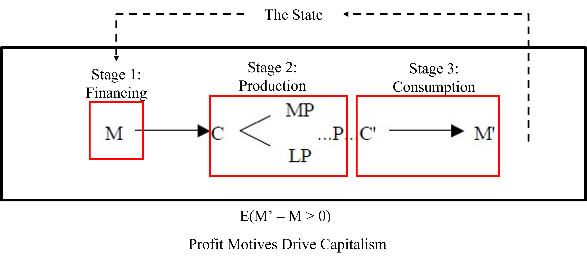
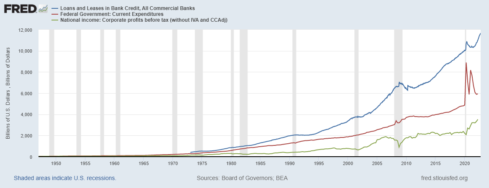
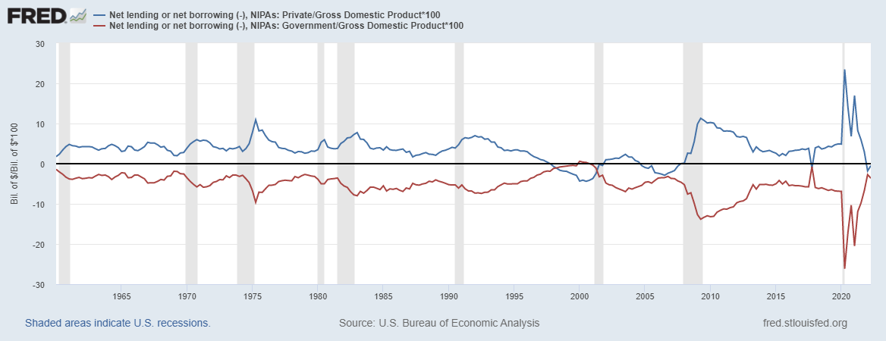

---
output:
  pdf_document: default
  html_document: default
---

# Profits, Deficits, and Inequality

## Purpose & Learning Objectives

The purpose of this chapter is to answer a critical question: Where do profits come from? In answering this question, we will need to address two related issues: money and taxes. This chapter will present students with a comprehensive view of the creation of profits at the macroeconomic level. In addition, it will provide students with an organized and detailed review of the *Kalecki Profit Equation* derived by Polish Economist Michael Kalecki (1969).^[Jerome Levy is credited with uncovering this equation some 30 years years before Kalecki. See a short but very readable paper [here](http://www.levyinstitute.org/pubs/wp309.pdf).] After exploring the derivation of the Kalecki Profit Equation, the chapter turns to grounding our understanding of profits in the real word, through measurement. We will explore two measures of profits and integrate these measures into our unfolding framework of the macroeconomy. After reading this chapter, students will be able to:

  1. Answer the question: Where do profits come from?
  2. Describe the relationship between money creation and profits.
  2. Derive the Kalecki Profit Equation.
  2. Define a "profit mark-up" and how it relates to prices.  
  3. Explain the logic behind the infamous phrase, "Capitalists get what they spend, workers spend what they get."
  4. Articulate the role of the State within the Circuit and how it uses its regulatory powers and spending/tax powers (specifically the federal deficit) to support profit expectations. 
  5. Discuss the implications of the Kalecki Profit Equation on the relationship between Capitalism and Income Inequality.

## The Role of Profits in a Capitalist Economy
Chapter 2 introduced students to our initial framework for a Capitalist economy. The framework guides our analysis of the economy and helps us ask important questions about the stages and actors in that framework. We described an economic system guided by profit expectations. This raises a logical follow-up question: Just where do these profits come from? This question, it turns out, has a straight-forward answer. But, it will be one that you have largely been trained not to like and/or not to see. Profits, in a Capitalist economy, necessarily take the form of money. Therefore, to truly understand where profits come from in the system, we first need to understand how money gets created AND who gets to do the creating. Here we go. 

At this point, we are going to modify our framework from Chapter 2. Recall our discussion of frameworks both in class and previously in this text. Frameworks are tools to focus our attention, to guide our analysis in a thoughtful way. However, frameworks come at a price: they make us forget about what we do not see.^[Essentially just like "The Silence" in Dr. Who.] Frameworks help us ask relevant and often powerful questions about the elements of the system we have put in play, but it is damn near impossible for us to ask questions about actors/stages/processes in the world that are not a part of our framework. And so, in this chapter we begin the process that we will continue throughout this book: we build the framework up. 

Figure 3.1 below takes our framework from Chapter 2 and properly locates "the State" as a powerful and central actor to this story. This diagram illustrates what I expect to come as no surprise: the state, or the administrative actors of the country, are just as important to the functioning of any economic system as the Worker, the Capitalist, or the Banker.
```{r, echo = F, fig.align='center', fig.cap= "Placing the State in Capitalism"}




```

### A Story of Money Creation

#### State Money 

At this point, we need to answer an important question: Where does that money in Stage 1 come from? In general, the money we use in our economy comes from two places: the State and banks. National governments - at least those that issue their own currency - create new money every time they spend (see the dashed line moving from the State to Stage 1 in Figure 3.1 above). Now, this is one of those places where I'm going to ask you to unlearn something:**The Government spends first and taxes back later**. Put more directly, **The Government doesn't need your tax dollars to spend its dollar**. Read that again and sit with it for a second....

You know the logic of this statement already, and yet every fiber of your being is pushing back against this fact. Think it through and let logic and reason win. To paraphrase Matt Damon in [The Martian](https://www.rottentomatoes.com/m/the_martian), "Let's logic the s#%* out of this",

  1.    The Government is the sole issuer of the U.S. dollar.
  2.    No one else can produce the U.S. dollar (or they go to jail for a long time!)
  3.    We are required to pay taxes in the U.S. dollar.
  4.    To pay the taxes in the U.S. dollar, we first have to accumulate those dollars from the economy.
  5.    This means, logically, the dollars must be in the economy first, before anyone can pay their taxes.
  
Government spending happens first. Taxes happen later. It's logic. 

Every time the Government buys goods or services from the economy, it creates new money and sends it to household bank accounts and business bank accounts all across the country. Once that money is spent on goods/services/wages, that money is then used to buy other stuff (paper, cars, child care, computers, etc.). And this process keeps going. That new injection of money from the Government just keeps getting used by people and business throughout the economy. At the end of the year, we then calculate our income tax returns and pay taxes with the U.S. dollars we have accumulated.

So, if taxes aren't necessary for the State to spend, why tax at all? There are a few important reasons^[We might want to discourage certain activities, we might want to help reduce the gaps in incomes, and/or we might want to make room to encourage specific activities. We will talk about these more in class. For now though, I just want your attention on the two core reasons for any tax system.], but the core reason is to ensure that there is a demand for State's currency. Think about it. The State wants us to do things for it. It wants roads, schools, fire fighters, buildings, etc. To get us to do those things it has two options: carrot or stick. The stick is the State's police force. It can throw you in jail if you don't do what it tells you to. But, force is hard to sustain. More importantly though, what is to keep the police force itself from turning on the state? The carrot. The State says, "You must pay a tax every year and you must pay it in my currency." In doing this, the State ensures that we all (including the police forces) will try to go do things that earn U.S. dollars. Those things are things the State wants us to do. We do them; we get paid; and then we can pay our taxes. But wait! Taxes do more still! 

**Taxes create the private sector**. Yeah, that's another one where every fiber of your being is trying to push back. But, again, let logic prevail. Recognize what happens when we, as individuals, all try to go earn U.S. dollars so that we can pay our tax. We all have a common tax requirement and we all have to pay those taxes in U.S. dollars. But, that doesn't mean we all have to work directly for the Government to get those dollars. Assume for a moment that you are a great cook. You love cooking things for others. But, you currently work on a road construction crew. Well, instead of working directly for that crew you could open up a restaurant instead. That crew can take their U.S. dollars they earn from working for the State and come and spend that money with you in exchange for an awesome meal. The better your restaurant skills are, the more your culinary empire grows. Soon the teachers are spending their money with you, then the firefighters, police officers, bus drivers, etc. You are accumulating U.S. dollars but **not** from doing work explicitly for the government. And, with those dollars you can pay your tax. That's a pretty incredible thing. **Taxes both create demand for the State's currency and it ensures that we all use that currency with each other!**

Now, this brings us closer to the answer on profits. But let's explore this idea of the tax a bit further yet. Now that we understand what is happening with a tax, it makes sense to ask "how large is the tax"? Let's look at the extremes: tax back 100% of the dollars spent into the economy by the State. Think about what that does. Everything you earn working for the State directly or indirectly with your restaurant is taxed back...well that would be really stupid by the State. That doesn't leave anything left for people to use on their own. If the currency has no use beyond paying taxes (and not going to prison) then we all might as well revolt right now. Now, go to the other extreme. Assume the government doesn't tax at all. Well, then that currency is effectively useless (good for burning and arts and crafts proejcts with the kids though!). So, clearly taxes must be somewhere in the middle. This is just strategy. Low taxes bring risks (too much of the currency in the system OR too few goods and services being produced for the State), but High taxes bring risks too (higher risk of citizen anger - unless you offset other costs in exchange for the high taxes, e.g. make college and/or health care free). There isn't an "optimal" answer here, at least not in the real world. But, whatever you decide does have some implications for profit expectations and profit realization in the economy. 

Profits cannot exist in an economy without money. I know I just keep throwing these bombs at you, but again think it through. Profits happen when a private producer (you the restaurateur) accumulates State money in excess of the State money you originally advanced for the business. Out of those profits you pay your tax to the State. What remains then are your **net profits**. What happens if the State doesn't leave much money in the system (i.e. higher income taxes)? Well, then there are fewer dollars left in the economy to be divided between the wages paid to workers and the profits that accrue to Capitalists. Therefore, there is a direct link between profits and Government spending. More spending means more profits, period. This will largely depend on the **distribution of income** though. If the wage share of output ($$\frac{W}{Y}$$) is large, then the additional profits available from the additional State spending will be relatively small. However, if the wage share is low then the pool of profits will increase substantially with each new round of Government spending. This concept of the distribution of income will play a central role in this course; my hope is that this story starts to illustrate why.

So, we have one part of the answer to our question: Where do profits come from? That first answer is: State money and the tax requirement. State money is spent into a system where we all go after the same currency. In that environment, profits can accrue to some individuals. Now, that's only part of the answer though. The second part of the answer is that profits are created when Banks create money, so-called "Bank money". And they do this every time they lend. Let's walk through it.

#### Bank Money

The second part of the money creation story comes from the financial sector: Bank money. Here again, you're going to need to unlearn a few things about banks. Ready? 

**Banks do not lend out of deposits**. Your bank does not take the money in your savings account and lend it out. That is a myth. In fact, is has essentially never been the case for banks (whether they use the U.S. dollar, gold, or some other money thing). So what do banks do then? 

Let's say you don't have enough State dollars saved under your mattress to fund your restaurant. So, you go to a bank. You bring them your business plan and it looks great. They approve your loan for \$100,000. To emphasize the point, **the bank does not take \$100,000 out of someone else's deposit account**. It simply adds \$100,000 to your account AND then adds \$100,000 to its ledger on the accounts receivable side (i.e. it tracks that you owe the bank \$100k). Where did that money come from? Thin air. They just created the money through their keyboard. That's it.^[You might be tempted to call it "fake money". Don't. I promise you, that money is real in the sense that it is used directly by all of us.] 

At this point, the Bank has created **money**, which Abba Lerner defined as "What we use to buy things." Now that your account is flush, you've successfully completed Stage 1! Good work! So you move on to stage 2. You start spending that money. And every time you spend that money you're creating incomes for others (both in wages and profits). And that money stays in the system as a part of the "money supply". It stays in the system until you start making loan payments. Every time you make a payment you are actually taking money out of the economy (i.e. paying off a loan is just like paying your tax bill). So, every time a bank creates a loan (which happens a lot!) new money is being injected into the economy. Unlike State money though, Bank money is temporary. Everything that is created is eventually destroyed when the loan is paid in full. State money, that isn't taxed back, actually stays in the economy. 

Now we have the second part of our answer to the question, "Where do profits come from?" At its most basic level, profits are generated when money is created. New dollars are made available for use in the economy and as those dollars are spent, they create incomes for others - part of which goes to wages and the other part to profits. More specifically, the two sources of profits are *Government Expenditure* by the State and *Loans* by banks. 

Figure 3.2 below illustrates both expenditure items and includes *Corporate profits before taxes*. Take a look at it. Which series does corporate profits seem to move with the most? Why is the corporate profits line less than both the Government Expenditures and Bank Loans and Leases?^[What does it tell you about the economy if corporate profits pretty consistently account for 10-20\% of total Federal Government Expenditures and Bank Loans and Leases in the economy (occasionally a bit more or less)?]

```{r, echo = F, fig.align='center', fig.cap= "Placing the State in Capitalism"}




```

There you have it. Profits are created when new money is spent into the economy AND is left in the economy at least temporarily. That's the simple answer. But, this answer just tells us where it comes from, it doesn't help us understand the factors that determine the *level* of profits in the economy. For that, we turn to the **Kalecki Profit Equation**.

## The Place of the Profit Equation
The Kalecki Profit Equation plays a critical role in our understanding of Capitalism. The Kalecki Profit Equation essentially formalizes Marx's *Circuit of Capital*. It answers a critical question too: **What determines the level of profits at the macro-level?**

The answer to this question also has an important implication for the order of things. I want to highlight that here: the equation determines the level of profits at the macroeconomic level. It does not determine the profit-level of a business or sector. Instead, it suggests the level of profits that Capitalists are competing for. And make no mistake, Capitalists do compete against each other, fiercely so. And that's a great thing for all of us.^[Which is one reason why the increasing market concentration across all industries is a real problem.] 

### The original two-sector model

Here, I'm going to derive our first real mathematical model, an equation. I will go slowly through this, but it is up to you to go over this several times to ensure you both know the profit equation AND how it was derived. Again, take it slow but be dilligent.

First, we will do it as Kalecki did: we will ignore the rest of the world and the government. The second time around I'll add the government back in (on both sides). Let's start with the two-sector model with just households that consume ($C$) and businesses that invest ($I$).The Profit Equation begins with the GDP **accounting identity** that says total incomes must equal total spending. Total spending occurs through the consumption ($C$) and Investment ($I$) variables. But, total incomes are different. For now, as Kalecki did, we will assume a society made up of workers who earn wages ($W$) and Capitalists who earn profits ($\pi$). Equation 1 below illustrates the identity. 

\begin{equation}
Wages (W) + Profits (\pi) = Consumption (C) + Investment (I)
\end{equation}

Kalecki then divides consumption into its sources of income: $C = C_w + C_{\pi}$, where $C_w$ is "consumption out of wages" and $C_{\pi}$ is "consumption out of profits". Substitute this into Equation 1.

\begin{equation}
W + \pi = C_w + C_{\pi} + I
\end{equation}

Next, subtract $C_w$ from both sides.

\begin{equation}
W - C_w + \pi = C_{\pi} + I
\end{equation}

Now the right-hand side of the equation only consists of Capitalist spending out of their own profits and Capitalists spending through the businesses they own.

The left-hand side  of the equation consistes of the wages workers earn less their spending out of wages, plus Capitalist profits. We can clarify then that $W - C_w = S_w$, or "savings out of wages". Substitute that into Equation 3 below.  

\begin{equation}
S_w + \pi = C_{\pi} + I
\end{equation}

Finally, let's get profits by itself on the left-hand side. Kalecki's original profit equation is now complete:

\begin{equation}
\pi = C_{\pi} + I - S_w
\end{equation}

Equation 5 provides the answer to the question posed above: What determines the level of profits across the economy as a whole? 

Equation 5 also highlights a fundamental truth about the inherent incentives in a Capitalist economy. Recall that savings out of wages ($S_w = W - C_w$). If we plug this back into Equation 6, we see that worker's own spending actually adds to Capitalist profits in that period. The wages paid out to workers is the real problem for profit acccumulation. As workers are paid more, on average, their wages absorb what would otherwise be accumulated profits. However, it is possible that the level of wages and the level of profits could still increase, due to a sizeable increase in investment. But, if we divide both sides of Equation 6 by GDP ($Y$), we can see what the Kalecki Profit Equation can tell us about the distribution of income between profit's share of output ($\frac{\pi}{Y}$) and labor's share of output ($\frac{W}{Y}$).

\begin(equation)
\frac{\pi}{Y} = \frac{C_{\pi} + C_w}{Y} + \frac{I}{Y} - \frac{W}{Y}
\end{equation}

Equation 14 presents the true recipie of the Capitalist system. Though it is possible for the levels of wages and profits to both rise, it is not possible for labor's share of income to rise and profit's share of income to rise simultaneously. They are negatively related. Any gains by workers, will necessarily come at the expense of Capitalists. This has serious implications for a system that we are all "bought into" to some extent. We all depend on this process working. Therefore, the strongest incentives in the system are to support an increasing share of income for Capitalists at the expense of the Worker's share of income. It's quite literally, "backed into the cake".

### Implications of the two-sector model
Kalecki argues that total profits are determined by Capitalist's own spending out of their previously accumulated profits and Capitalist's own spending through the businesses they own via investment. The Equation also highlights the relationship between profits and wages. 

As workers save more, this necessarily reduces the level of profits^[And remember those profits are what firms are competing to accumulate.] Recall that $S_w = W - C_w$. So, from the Capitalist perspective your goal is to minimize worker savings. There are two ways to do that. First, you can keep wages low. Or, taking the approach attributed to Henry Ford, you can increase worker consumption out of the wages they are paid.

Nicholas Kaldor summed up Kalecki's findings in the effective phrase: "**Capitalists get what they spend; workers spend what they get.**"

### The multi-sector model 
Now, let's make this a bit more relevant by bringing the government into the fold, along with the financial sector, property owners, and the rest of the world. 

\begin{equation}
Wages (W) + Profits (\pi) + Interest (i) + Rent (r) + Taxes (T) = Consumption (C) + Investment (I) + Government Spending (G) + Exports (X) - Imports (M)
\end{equation}

Reproduce the same steps as before. Break consumption into two classes. Solve for worker savings and then solve for profits. After doing so, you should get the following:

\begin{equation}
\pi = \underbrace{C_{\pi} + I + G + X}_{\text{Gross Profits}} - \underbrace{M - i - r - T - S_w}_{\text{Expenses out of Gross Profits}}
\end{equation}

Equation 7 identifies the sources of profit generation in the economy and the expenses that are paid out of gross profits. This is useful, but we can rearrange this a bit to clarify some relationships.

\begin{equation}
\pi = C_{\pi} + I + (G - T) + (X - M) - i - r - S_w
\end{equation}

Equation 8 arranges the variables in more useful terms. Let's unpack this equation a bit. 

\begin{equation}
\pi = \underbrace{C_{\pi} + I}_{\text{Capitalist's own spending}} + \underbrace{(G - T)}_{\text{the government deficit}} + \underbrace{(X - M)}_{\text{the rest of the world}} - \underbrace{i - r}_{\text{financial and capital markets}} - \underbrace{S_w}_{\text{labor markets}}
\end{equation}

### Implications of the multi-sector model
In looking at Equation 9, we can see the individual pieces to the story of profits at the macro level. The original finding still holds. One of the major sources of Capitalist profits are Capitalists themselves. But we also have two additional sources of profits: the domestic public sector's deficit spending and the rest of the world (but only if $X > M$). The rest of the factors detract from profits, including interest paid to the financial sector, rents paid to property owners, and as before, worker savings out of wages. 

In the U.S. context, and much of the developed world, net exports (X - M) is actually negative, meaning they import more than they export. So, in reality, the primary sources of net profits at the macro level are Capitalists themselves - through their own spending out of past profits and the spending of the firms they own - and the domestic public sector's deficit. 

## How do Capitalists get what they spend?
Let's talk for a moment about how this works. Here, I'm going to introduce the notion of a profit markup on costs ($\mu$). Most prices in the economy are set by adding a profit markup on top of costs.^[This actually gets pretty complicated. Some firms might add a markup to unit costs, some firms might just target a particular return, etc. The point is the profit markup covers some amount of overhead costs (i.e. pay managers), plus the rate of profit the Capitalist wants/is able to achieve, given market conditions.] So, every time you buy a pop, a pizza, a notebook, etc. the prices you are paying include a profit markup, $\mu$.^[We can offer a general equation to describe this pricing behavior too:

\begin{equation}
P = (1+\mu)wN
\end{equation}

Equation 10 just formalizes this relationship. $\mu$ is the profit-markup on costs (which I'm just describing here as the average hourly wage ($w$) times the total number of hours worked ($N$)). This suggests that prices ($P$) can rise due to an increase in the markup, wages paid, or hours worked. However, this is a relationship we will explore in much more detail in Chapter 7.]

With this understanding, we can now see how Capitalist household spending adds to profits. Everything they purchase contains a profit markup. The same is true of business investment. When firms invest, they buy goods and services from other firms, at prices set by those other firms - prices that include their profit markups. When the public sector spends, they do so directly to workers (who then go buy products at prices that include markups) or contract directly with firms at prices that include profit markups. In short, **nearly all spending generates profits somewhere in the system.**

## Profits and Deficits
This chapter has outlined the role of State spending and bank lending in creating the potential scale of profits at the macroeconomic level. The four sources of profit creation are Capitalists own spending on consumption goods, Workers own spending on consumption goods, Capitalists own spending on Investment goods, and the State's deficit spending - the money it spends into the economy but does not tax back. We will turn to investment spending in Chapter 6. Here though, I want to explore the State's deficit spending in more detail using the **Sectoral Balances Equation** pioneered by the British Economist [Wynne Godley](https://www.levyinstitute.org/scholars/wynne-godley). 

We can derive the Sectoral Balances Equation from the Kalecki Profit Equation itself. Beginning with Equation 9, we can move all of the domestic private sector incomes and spending to the left-hand side of the equals sign. The result is a simple but powerful accounting identity:

\begin{equation}
\pi + i + r) -C_{\pi} + S_w - I  =  (G - T) + (X - M)
\end{equation}

\begin{equation}
\underbrace{S_{\pi} + S_w - I}_\text{Domestic Private Savings}  =  \underbrace{(G - T)}_\text{Public Sector Deficit} + \underbrace{(X - M)}_\text{Trade Deficit}
\end{equation}

Equation 13 lays it all out there. The left-hand side of the equation represents "Net Financial Assets" of the "Domestic Private Sector". In other words, it indicates how much the savings accounts of individuals in the U.S. domestic private sector have grown in a given period. But, these net financial assets must come from somewhere, and equation 13 articulates those potential sources of wealth accumulation: the domestic public sector deficit ($G > T$) OR a trade surplus ($X > M$). In the case of the US, this reveals an uncomfortable truth for many, but it is a truth nonetheless. We have a structural trade deficit ($X < M$). That means the only way our domestic private sector can accumulate net financial assets (i.e. can accumulate wealth) is if the US Government engages in deficit spending at a rate that exceeds the leakage from our trade deficit! In other words, **the US Government's deficit must be larger than the US Trade Deficit**...all the time! Here again, your mind wants to say, "that can't be right". Well, look for yourself:

Figure 3.3 illustrates Equation 13 in action. I've excluded the trade deficit from this visual to illustrate the connection between the domestic public sector and the domestic private sector. 

```{r, echo = F, fig.align='center', fig.cap= "US Sectoral Balances (1960 - 2022)"}




```
We see the exact relationship we would expect, given the structural trade deficit. The US Government is essentially always in a deficit position. You've been trained to believe that's bad. But, as [Dr. Stephanie Kelton](https://stephaniekelton.com/about/) likes to point out, "One sector's deficit is another person's surplus!" The Government deficit is our surplus. It's the money left in the economy that isn't taxed back. And, as the Kalecki Profit Equation shows us, it's a primary source of net profits in the economy. 

What happens if the State does not engage in deficit spending? Well, we have an example right there in Figure 3.3 but before we walk through that, let's see if we can guess.

Our exploration of the structure of the US economy suggests that profits and profit expectations are critical to the operation of the Circuit of Capital. If public sector deficits aren't large enough to offset the trade deficit, this would result in a net loss of net financial assets in the domestic private sector. Recall, that sector combines for about 85% of GDP. So, if we start sucking resources out of that spending that will hurt sales of final goods and services in the economy (both in consumption and in investment). In other words, it will cause an economic downturn. 

Well, that's exactly what happened in from 1998 through 2001 and then again from 2004 through 2007. In both cases, the US public defict was either too small or actually in surplus! As the economy lost out on State money, it moved to replace it with bank money (go look at Figure 3.2 again). But, households and firms can only take on so much debt before the house of cards comes tumbling down. At tumble it did. The takeaway here is simple, though strongly counter to conventional wisdom: **State deficits aren't just good for profits, they are critical to the health of the economy.**

## Conclusion


a