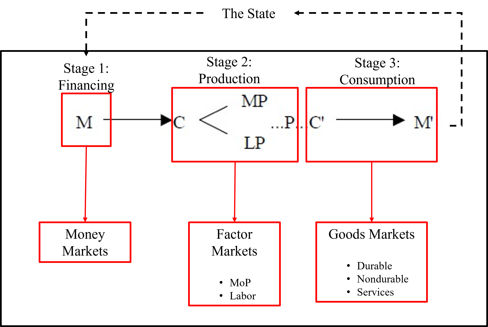
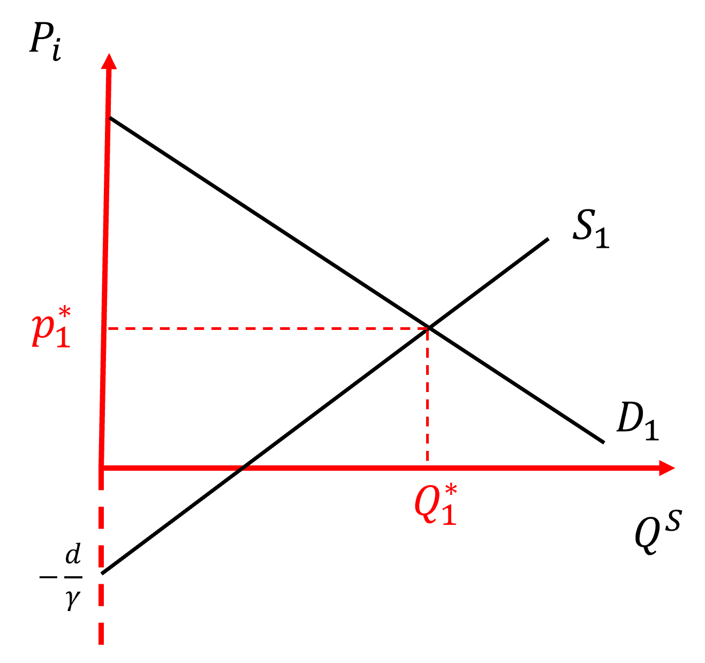
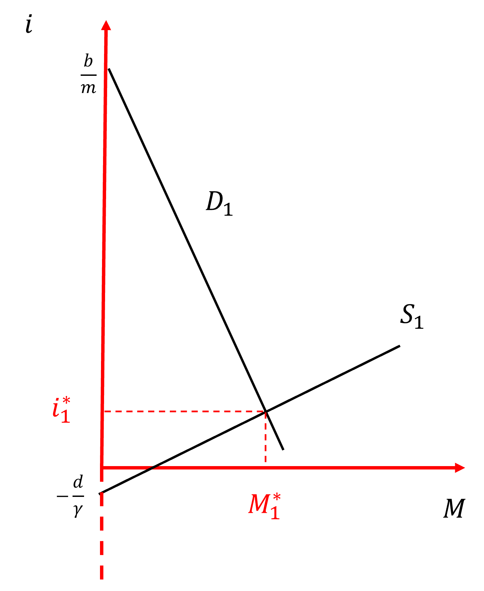
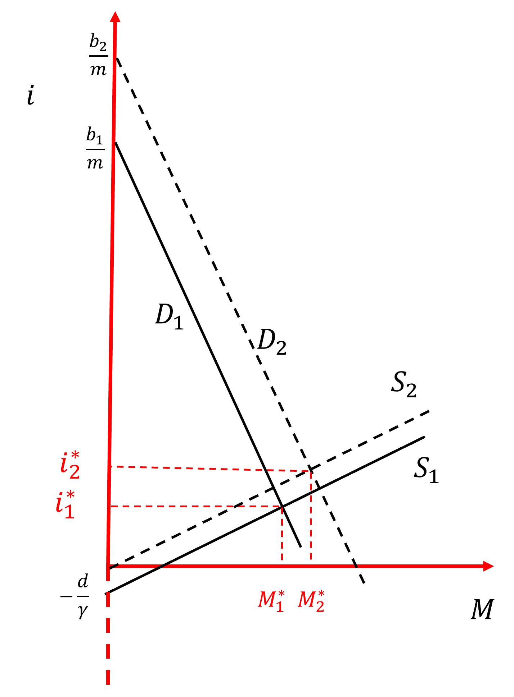
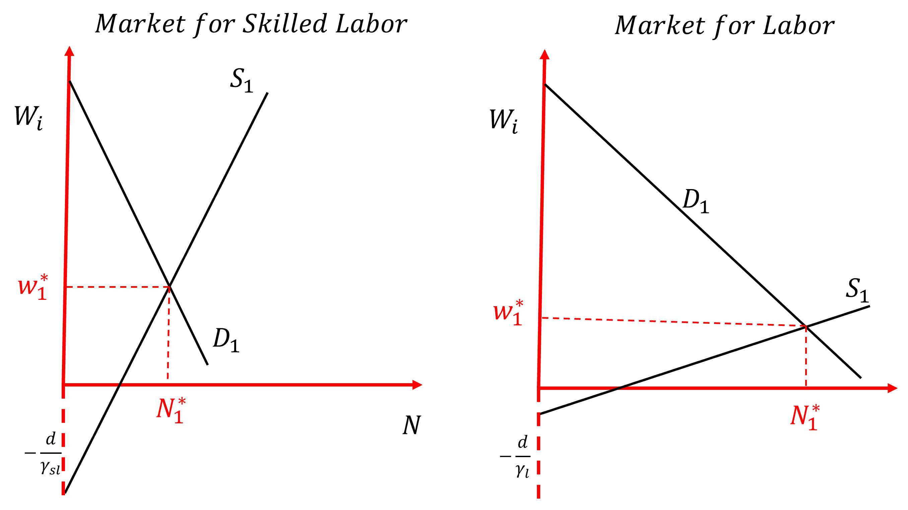
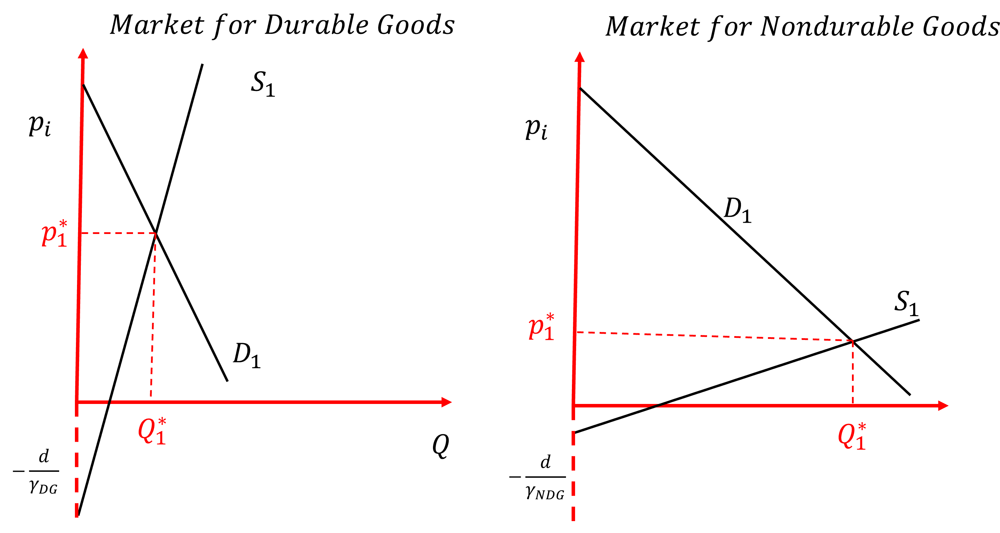

---
output:
  pdf_document: default
  html_document: default
---

# Capitalism and Markets

## Purpose & Learning Objectives
Chapters 1-3 have focused on describing a Capitalist economy, articulating its structure, and describing the incentives inherent in that structure. In this chapter, we expand our Capitalist framework to unpack the central organizing mechanisms of a Capitalist system: markets. After reading through this chapter, students will be able to:

  *   Articulate the essential markets of a Capitalist economy
  *   Define a competitive market
  *   Derive and Visualize a Market Demand Curve
  *   Derive and Visualize a Market Supply Curve
  *   Utilize a model of a market to conduct economic analysis

## The Role of Markets in a Capitalist Economy
**Capitalism** is an economic system organized around the private ownership of the means of production,  coordinated through markets, and sustained through purchased labor. Our task in this chapter is develop our understanding of the role markets play in a Capitalist economy, how they function, and how they might change. Here, we will learn to use the infamous market model of *Market Supply and Market Demand*. But first, we need to properly describe the place of markets in our framework and construct some theory as to how they function.

Figure 4.1 illustrates our extended framework. Here, we see that each stage functions through a set of markets. Stage 1 operates through so-called **money markets**. Stage 2 is coordinated through **factor markets**. Stage 3 functions through **goods markets**. Our task at this point is to understand what markets are, how these markets **should** work, and how these markets are inherently different. 

```{r, echo = F, fig.align='center', fig.cap= "Clarifying the Role of Markets"}




```

Markets are misunderstood creatures. They are incredibly powerful institutions of Capitalism, but they are not the almost all-powerful force that can often be described by market zealots. Rather, markets are tools; they are a uniquely human technology. We create them; we reproduce them; we modify them; they are ours. Within our framework, markets are essential components of the Circuit; however, they do not exist outside of the State nor its money.^[This does not mean that there aren't markets that exist outside of State oversight or direct influence. However, these instances are rare and hardly sustainable. Therefore, we will not focus on them here.] States and the money they create and/or utilize play a central role in establishing, monitoring, and enforcing the functioning of markets.

Before we can move to examine each market though, we need a clear description (theory) of how markets work.

## Framework to Theory to Model: How markets work
This section will outline the standard economic theory of markets and teach you how to develop an appropriate market model for your own use. Then, we will use our model to accurately describe the markets that define Capitalism.

### Theorizing Markets
In economics, markets come in two forms: competitive and not competitive. Our stated goal is to ensure competition and there's a good reason why. Competition has great spillovers^[What you'll come to call "externalities" in Principles of Micro.] It generates more products to choose from and it puts downward pressure on prices. Why? Because there are two essential characteristics of a **competitive market**:

  1. There are many buyers and sellers of the (essentially) same good or service.
  2. All actors in the market are **price takers** - they have no ability to individually affect the market price.

Competitive markets, therefore, have two sides. They have many buyers that demand a good/service. And, they have many sellers that supply that good/service. Let's unpack both sides separately here and then we will put them back together.

#### Market Demand
Let's just think logically about this for moment. Market Demand represents some quantity ($Q^D$) of that good/service that consumers want to buy (if they can). In economic theory, we tend to view that quantity as varying based upon the price of that good or service in that market. Higher prices will necessarily lead to lower quantities sold; lower prices will see more quantity consumed. We can formally describe this relationship with a simple linear equation.

Remember from 8^th^ grade algebra that the equation for a line is $Y = b + mX$, where $Y$ is the y-axis variable, b is the y-intercept, $X$ is the x-axis variable, and m is the slope - the average relationship between $X$ and $Y$. We can use this basic form to describe market demand. 

\begin{equation}
Q^D_i = b - mp_i
\end{equation}

Equation 4.1 illustrates a mathematical description of consumers buying behavior in a given market for a specific good ($i$). There is some typical level of consumption ($b$) of good $i$, regardless of the price ($p_i$). However, as the price of the good changes, the quantity demanded $Q^D_i$ for good $i$ changes by some typical amount $m$ and in the opposite direction of the price change. To put $m$ in more economic terms, it tells you how **price sensitive** consumers in this market are. Small values of $m$ suggest that consumers do not change their buying behavior by much if the price changes. Large values of $m$ suggest the opposite. Consumers in this market care quite a bit about the price of the good. Let's give this some numbers and walk it through. 

\begin{center}
$Q^D_i = 100 -2p_i$
\end{center}

Let's assume these numbers describe market demand for some good. Regardless of the price, consumers in this market will consume 100 units (this is the y-intercept). However, as the price of the good increases by \$1 the quantity consumed decreases by 2. That's because the slope of this equation is $-2$.

Now, economists like to visualize markets in $(Q_i, p_i)$ space (read "q,p space"). Meaning, we like to put the price on the y-axis and the quantity on the x-axis.^[There's a long history as to why we do this. Alfred Marshall, a trained mathematician, created this diagram to visualize the operations of markets in the very short run, essentially where changes in quantities in the market were negligible and all that could really change was the price.] To "draw" the demand curve in $(Q_i, p_i)$ space though I need to make sure that the price variable in equation 4.1 is alone on the left-hand-side of the equals sign. I need to "solve the equation for $p_i$." Try to do that on your own first. Then, walk through the following steps and see how you did.

\begin{center}
$Q^D_i = b -mp_i$  //
$Q^D_i  + mp_i = b $ //
$mp_i = b - Q^D_i $ //
\end{center}

Dividing both sides in the equation above by the slope ($m$) yields the so-called **Inverse Market Demand Function** in Equation 4.2. This equation puts the market price on the y-axis. It has a positive y-intercept ($\frac{b}{m}$) that is moderated by the price sensitivity of consumers in this market ($m$). If consumers are price sensitive (big $m$), then the y-intercept will be smaller. If consumers aren't price sensitive (small $m$), then the y-intercept will be relatively large.

\begin{equation}
p_i = \frac{b}{m} - \frac{1}{m} Q^D_i
\end{equation}


Figure 4.1 illustrates this downward sloping market demand curve. It illustrates how many units of this good/service will be purchased by consumers in this market for a given market price. The slope of the line is negative, illustrating the inverse relationship between market price and the quantity demanded by the market. This inverse relationship between $p$ and $Q^D$ is known as the **Law of Demand**. 
```{r, echo = F, fig.align='center', fig.cap= "A Market Demand Curve"}


knitr::include_graphics("Demand.png")

```

The position of the market demand curve is governed by **shifters** of Market Demand, $b$, and the price sensitivity of consumers in this specific market. As the price sensitivity increases (big $m$), the y-intercept falls (suggesting the product market can be described as a relatively low-priced good/service. The slope of the demand curve is negative and reflects the price sensitivity of consumers in that market. If they are price sensitive (big $m$), then the slope of the demand curve will be much flatter. Conversely, more price insensitive markets will face a relatively higher intercept and steeper demand curve. Before you move on, think about the kinds of goods that you look for the lowest price before you buy. 

Price sensitivity is an important topic when it comes to markets. Think about your life. What goods do you "shop around" for before you buy them? What tends to be different about those goods? There are essentially two characteristics to goods with flat demand curves compared to goods markets with steep demand curves. 

  1. Lots of options for simultaneous options for consumers. 
  2. The good is more of a *want* rather than a *need*.
  
The first characteristic of a price sensitive market is that there are many producers of the same good at the same time. In other words, consumers in that market have lots of options to choose from! Where there are options, producers have to compete on price or quality (or both!). In markets that don't have lots of producers competing for every consumer's dollar though, there just aren't as many options. In these markets, the market demand curve will be steeper - not becuase consumers wouldn't prefer to be price sensitive, but because the structure of the market does not permit them to be.

The second characteristic relies on just how important that good is to lots of consumers. The market for rental housing is *price insensitive*. In some cases, it is because there aren't many options. However, in most cases it has more to do with the time-sensitive demand driving consumer decisions. If the good is something they must have (e.g. an apartment, a working car, your morning coffee, etc.) consumers just don't shop around on price. They take price for granted and focus on the essential characteristics of the good or service they need. 

#### Market Supply
We will follow the identical steps to describe the supply side of our theoretical market. The supply curve belongs to the "many sellers" of the same good that exist in the market. It represents the quantities of the good/service they will bring to the market based upon the price.^[Note well, this relationship is not illustrating the level of production. It is illustrating how much of produced outputs are actually brought to the market to be sold INSTEAD OF being sent to the warehouse to be stored.] 

We can describe the quantity of goods supplied to the market with equation 4.3.

\begin{equation}
Q^S_i = d + \gamma p_i 
\end{equation}

Here the y-intercept ($d$) represents the typical quantity of goods produced by by market suppliers regardless of the market price. The slope ($\gamma$) represents how price sensitive suppliers in this market are. As the price changes by some small amount, $\gamma$ tells us how much quantity supplied changes in response. If suppliers are sensitive to changes in the price level, then $\gamma$ will be relatively large. A small change in the price will lead to a large change in the quantity supplied to the market. On the other hand, if suppliers in the market are not price sensitive, then $\gamma$ will be relatively small. A small change in the price level will lead to a small quantity adjustment by producers of the good. 

Now, if we want to be able to draw a supply curve in Figure 4.1 we need to solve Equation 4.3 for the market price. Following the steps outlined above for the inverse market demand curve, we can derive the **Inverse Market Supply Function**.

\begin{equation}
p_i = - \frac{d}{\gamma} + \frac{1}{\gamma} Q^S_i
\end{equation}

Equation 4.4 illustrates the role of price sensitivity on the supply side. But, on the supply side price sensitivity takes a slightly different form. Consumers can be as price sensitive as they'd like so long as there are plenty of options to choose from. If they want to be price sensitive, then can in markets with at least some degree of competitive. However, suppliers of goods and services don't have that luxury. All producers would like to be price sensitive - they would love to be able to bring more product to the market the moment the market price rose. But, they are constrained by the type of good they are producing and the technology they are using to produce it. Simply put, the suppliers in a market are relatively price sensitive if they can quickly increase their productive capacity in response to a change in prices. It isn't about the desire to be price sensitive, it's about the ability to be price sensitive. If you are making toothpicks, odds are you can be quite responsive to changing prices. However, if you're making single-family homes, you simply do not have that luxury. The longer it takes to produce a good/service, the more price insensitive (small $gamma$) its producers will become.

Figure 4.3 illustrates the *Market Supply Curve** outlined in Equation 4.4. The position of that curve is shaped by the so-called **shifters** of supply ($d$) and the price sensitivity of producers ($\gamma$) of this good or service. We will address the shifters of supply and demand momentarily. Here though, I want to focus on supply-side price sensitivity. The y-intercept and slope of the Market Supply curve are modified and determined by $\gamma$. In markets where firms are able to be price sensitive $\gamma$ is relatively large. This would make the y-intercept relatively small though negative - pulling the intercept closer to the origin (0,0). In these same markets, the slope of the market supply curve would be relatively small, meaning that the curve would get flatter as $\gamma$ increased. On the other hand, in markets where firms were not able to be price sensitive, the intercept would be large though negative and the slope of the curve would quite steep. 

```{r, echo = F, fig.align='center', fig.cap= "A Market Supply Curve"}


knitr::include_graphics("Supply.png")

```

#### Putting it all together
Now that we have developed some theory about the Demand side and Supply side of our market, and we've developed a model that visualizes both sides, it is not time to put it all together into a useful little tool: its "Supply and Demand". Figure 4.4. illustrates the complete model. In placed the supply and demand curves on the same graph we see a new element to our market: its equilibrium.

**Equilibrium** is best viewed as "a point of rest" for the market price and quantity consumed. I'm also fine with you envisioning it as a gravitational pull that all market activity revolves around OR even looking at it like an average or typical outcome in the market. I don't really want you to think of it though as a specific price and a specific quantity. Instead, it's more of a ballpark. Now that we have a working model, it's time we put it to use. Let's see this thing in action.


```{r, echo = F, fig.align='center', fig.cap= "Visualizing 'The Market' "}




```

### Shifting Supply and/or Demand
To really put the model to use, we need to understand how the Demand and Supply curves move. Both sides of the market are shaped by a number of factors. These factors are referred to as "shifters" and they determine - in conjunction with the relative price sensitivity of the market actors - the position of the y-intercepts for both sides of the market. In this section, we are going to walk through them succinctly. I will not graph them here as we did that in class. However, I will walk through the formal placeholders. Then, we will use the model that the theory constructs to examine three specific markets and potential shocks. 

#### Shifters of Market Demand
The Market Demand Curve is shaped by five essential characteristics of any specific market:

  1. Incomes of consumers in the market ($Y$)
  2. The price of related goods ($p_j$)
    *   Substitute Goods 
    *   Complementary Goods
  3. Tastes and preferences of consumers ($z$)
  4. Future price expectations ($e_p$)
  5. Number of consumers ($N^c$)
  
All of these factors are essentially embedded within $b$ in the Market Demand Curve. Taking price sensitivity as given for the moment, we can describe all of these factors clearly.

  * An **increase** in income will increase the amount of a normal good that is consumed by the market regardless of its price, in other words, an **increase** in incomes ($Y$) will lead to an **increase** in $b$. 
  * An **increase** in the price of a substitute, $p^s_j$ good will lead to an **increase** in $b$. 
  * An **increase** in the price of a complementary good, $p^c_j$) will **decrease** $b$. 
  * An **increase** in the tastes and preferences ($z$) will lead to an **increase** in $b$.
  * An **increase** in consumer expectations of the good's price in the future will lead to a **increase** in $b$ today.
  * An **increase** in the number of consumers will lead to an **increase** in $b$.

#### Shifters of Market Supply
The Market Supply Curve is shaped by five essential characteristics of any specific market:

  1. The Technology used to organize production ($T$)
  2. The price of material inputs ($p_m$)
  3. Nominal Wages ($w$)
  4. Future price expectations ($e_p$)
  5. Number of producers ($N^p$)
  
All of these factors are essentially embedded within $d$ in the Market Supply Curve. Taking price sensitivity as given for the moment, we can describe all of these factors clearly.

  * An **improvement** in technology will **increase** the amount of a normal good that can be produced by suppliers regardless of its market price, in other words, an **improvement** in technology ($T$) will lead to an **increase** in $d$. But, notice that means the supply curve intercept will just move farther away from zero because of that negative sign in front of the ratio $\frac{d}{\gamma}$. 
  * An **increase** in the price of material inputs, $p_m$ good will **decrease** the overall amount of output brought to the market outside of price movements, $d$. But, that will mean the y-intercept overall moves **up** the y-axis (i.e. it moves closer to zero). 
  * An **increase** in wages ($w$) will **decrease** the overall amount of output brought to the market outside of price movements, $d$. But, that will mean the y-intercept overall moves **up** the y-axis (i.e. it moves closer to zero).  
  * An **increase** in producer expectations of the good's price in the future ($e_p$) will lead to a **decrease** in $d$. But, that will mean the y-intercept overall moves **up** the y-axis (i.e. it moves closer to zero). 
  * An **increase** in the number of producers ($N^p$) will **increase** the overall level of output brought to the market by producers, $d$. This will make the ratio $\frac{d}{\gamma}$ larger, which has the effect of moving the supply curve farther away from zero and down the y-axis. 
  
Let's walk through three examples now to illustrate our model in action. We will walk through the set-up of the market description and then explore an **economic shock**, a exogenous event or force that moves - at least temporarily - the market out of equilibrium. 

## The Money Market
Stage 1 of the Circuit of Capital Financing, and, as we illustrated above in Figure 4.1, this stage is organized around a variety of so-called "money markets". For clarity, we will examine the market for venture capital - I know you all love [Shark Tank](https://abc.com/shows/shark-tank). So let's model it. 

I want you to walk through a specific process when you use this model. I'll call it out below in a series of steps.

*Step 1: Describe the price sensitivity of market actors*.

The first thing to do is to consider just how price sensitive consumers are for venture capital. In other words, how likely are people looking to buy money shopping around for it? Let's assume then don't shop much. They essentially look around for any money and they will largely give up some portion of their expected rate of return. In that case, we would expect $m$ in the Inverse Demand Function to be relatively small, i.e. price insensitive. If $m$ is small, that means that the y-intercept will be relatively large AND that its slope will be relatively steep. 

Next we have to consider the price sensitivity of the suppliers of venture capital. Can suppliers of VC dollars bring more money to the market quickly if they see a good deal? Absolutely. In that sense, we would expect $\gamma$ in the Inverse Supply Function to be relatively large. This suggests a relatively small negative y-intercept AND a relatively flat supply curve. 

*Step 2: Visualize this market*

```{r, echo = F, fig.align='center', fig.cap= "The Market for V.C. Funds"}




```

*Step 3: Describe the Market Elements*

Figure 4.5 visualizes the market for venture capital funds. The supply curve is relatively flat, indicating that suppliers of VC funding have the ability to quickly bring more money to this market if the price of money - the interest rate $i$ - warrants it. The supply of VC funds crosses the x-axis to the right of zero. This suggests there are always pro bono VC funds available, albeit this amount is seemingly visualized as "small". The market equilibrium is described by $M^*_1, i^*_1$. The depiction of this market seems to suggest that VC firms are willing to "sell" relatively large pools of VC money at somewhat low prices. However, caution is warranted here. We do know fully appreciate how large the y-intercept is for the demand curve. This would depend substantially on the price sensitivity of consumers in this market. 

*Step 4: Analyze the Shock*

Let's assume something happens in the world that scares VC investors. In fact, let's just say that hypothetically that banks, in response to the Federal Reserve raising rates, start raising interest rates across the board. How might this affect the market for Venture Capital? Well, let's walk through both sides of the market separately. 

\begin{equation}
b = f(Y, p_j, z, e_p, N^c)
\end{equation}

We have already determined the price sensitivity of buyers of VC funds. At this point, we are only interested in the relative position, the y-intercept, of the Market Demand curve. So, we need to ask has this shock affected the demand for VC funds?

  *   Well, did it change the incomes of buyers of VC funds? No.
  *   Did it change the price of a related good to VC? Yes! Bank financing is now more expensive. Okay, well, we know that means that $b$ increases.
  *   Did it change the tastes and preferences for VC funding? Probably not in any meaningful way. 
  *   Did it affect consumer's expectations of the future price of VC funding? You bet! Buyers of VC funding almost certainly would expect venture capitalists to follow the banks' lead. This also leads to an increase in $b$. 
  *   Does this change the number of consumers in the VC market? Quite possibly, although this is likely a relatively small effect. 
  
Consequently, our analysis of the demand side of this market clearly indicates that overall Market Demand will increase as a result of the Fed's actions. Okay, now on to the supply side.

\begin{equation}
d = f(T, p_m, w, e_p, N^p)
\end{equation}

We have already determined the price sensitivity of venture capitalists themselves. At this point, we are only interested in the relative position, the y-intercept, of the Market Supply curve. So, we need to ask has this shock affected the supply of VC funds?

  *   Well, did it change the technology used in the production of VC funds? No.
  *   Did it change the price of inputs into the supply of VC funds? Quite possibly. VC funds may actually be bank loans that are backed by VC funds. In other words, bank interest rates may be an input cost to VC suppliers. This would make $d$ smaller and therefore pull the supply curve up the y-axis. 
  *   Did wages of workers at VC fund firms change as a result of this shock? No.
  *   Did the future price expectations of VC funds suppliers change? Yes. They almost certainly expect to get slightly higher interest rates in exchange for their VC money in the near to the mid future. This would make $d$ smaller and therefore pull the supply curve up the y-axis. 
  *   Did the number of VC suppliers increase as a result of this shock? No.
  
Overall, our analysis of VC supply suggests that the supply curve should move up the y-axis. 

*Step 5: Visualize the new Market Equilibrium*

Figure 4.6 below illustrates the results of our systematic use of this model. An increase in bank lending rates should result in an overall increase in the demand for VC funding today, while simultaneously lead to a decrease in the supply of VC funds in the market today. These changes in the Market Demand and Market Supply curves yield a new equilibrium in the market, one with an increase in the price of VC funds ($i^*_2$) and an increase in the quantity of VC funds ($M^*_2$) purchased by consumers. It is also apparent that this shock has the effect of eliminating much, if not all, of the pro-bono VC funds that were previously available in this market.

```{r, echo = F, fig.align='center', fig.cap= "The Market for V.C. Funds with a shock to lending rates"}




```


## Factor Markets

Now, given what you've learned, use Figures 4.6 and 4.7 below to answer the following review questions:

  1. Describe a market for specific-skilled labor. 
  2. Describe a market for generic-skilled labor. 
  3. Looking at the figures below, what do these images suggest about these respective labor markets? Do they seem "in-line" with your sense of these markets? Why? Why not?
  4. Now, what happens to these US labor markets if there is a massive decrease in immigration of highly skilled technical workers? Be rigorous in your examination (i.e. go through steps 1-5 above!).
  
```{r, echo = F, fig.align='center', fig.cap= "Specific vs General Skilled Labor Markets"}




```  

## Goods Markets

Finally, I want you to explore the Durable and Nondurable Goods Markets. In a similar fashion, I want you to think about the differences between these two markets. Here, play particular attention to the Supply curve. What is it about these goods that generates such a distinctive Supply curve?

```{r, echo = F, fig.align='center', fig.cap= "Durable vs Nondurable Goods Markets"}




```  

  1. Describe a market for durable goods. 
  2. Describe a market for nondurable goods. 
  3. Looking at the figures above, what do these images suggest about these respective goods markets? Do they seem "in-line" with your sense of these markets? Why? Why not?
  4. Now, what happens to these markets if there is a massive shortage of supply inputs resulting in much more expensive input costs for firms in both markets? Be rigorous in your examination (i.e. go through steps 1-5 above!).
  
  